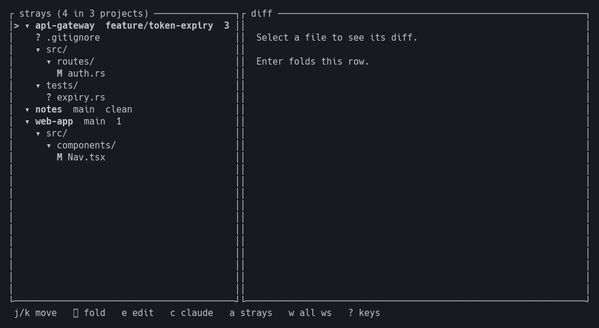
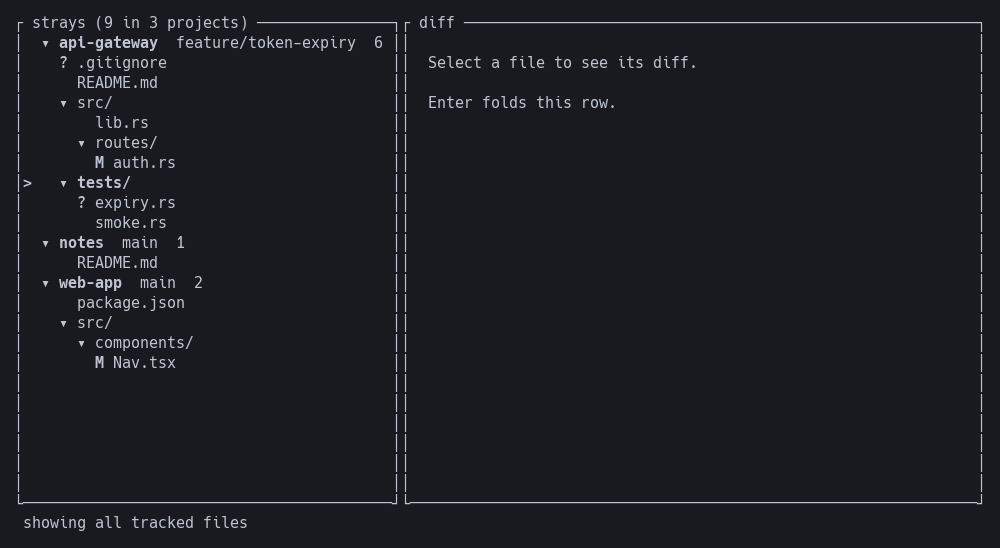
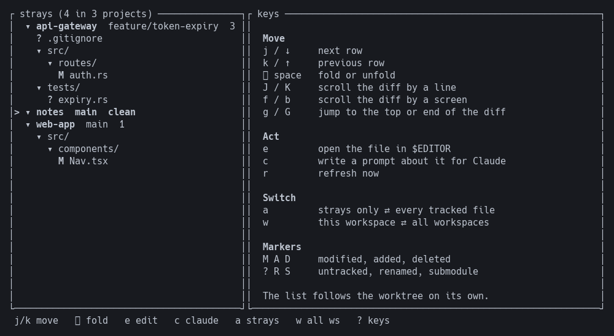

# strays

**See what changed. Read the diff. Hand it to Claude. Without leaving your terminal.**

A [herdr](https://herdr.dev) plugin that keeps a live picture of every file that
wandered off from `HEAD` — across every project you have open — beside the work
you are already doing.




---

## Why

You have four repositories open and an agent working in two of them. Somewhere
in there, files are changing. Finding out which ones means leaving what you are
doing, running `git status` in each repo in turn, and reading four separate
answers.

strays replaces that with a pane that is already correct. It updates itself as
the worktree changes, groups files by project and directory, and puts the diff
one keystroke away.

## What it does

**Follows the worktree, live.**
The list updates as files change — saves, checkouts, an agent editing on your
behalf. Driven by filesystem events, not a timer, so an idle repository costs
nothing and a busy one refreshes once rather than a hundred times.

**Knows about all your projects, shows you one.**
Opens scoped to the workspace you are in. One key widens it to every repository
herdr has open, each as its own foldable subtree.

**Puts the diff where you are looking.**
Select a file, read the change. Scroll a line, a screen, or straight to the end.
A position indicator tells you where you are in a long diff.

**Hands work to Claude without a context switch.**
Write a prompt about the selected file and it lands in the agent running in that
repository, with the path already attached. The text is typed into the agent's
input, not submitted — you read it and press Enter yourself.

**Opens your editor, safely.**
`$VISUAL`, then `$EDITOR`. The file path is passed as its own argument behind a
`--` separator and never reaches a shell, so a filename from someone else's
branch stays a filename.

**Reads, never writes.**
Every git call is a query. No `add`, no `commit`, no `checkout`, no `stash`,
nothing written to `refs/`.

## In practice

| | |
|---|---|
| **Projects** | Discovered from the working directories of herdr's open panes. Several panes in one repository collapse into one entry. |
| **Scope** | The current workspace by default; `w` widens to all of them. |
| **Branch** | Shown beside each project name, so you can tell at a glance which repo is on which branch. A detached HEAD shows its short commit rather than the word `HEAD`. |
| **Diff scope** | Working tree vs `HEAD` — staged, unstaged and untracked in one tree. |
| **Markers** | `M` modified · `A` added · `D` deleted · `?` untracked · `R` renamed · `S` submodule. The glyph carries the meaning, so mono terminals and colour-blind readers lose nothing. |
| **Views** | Strayed files, or `a` for every tracked file with changed ones highlighted. |
| **`.gitignore`** | Honoured. Build output never reaches the tree. |
| **Large directories** | A directory holding 25 or more strays starts folded with its count shown, so a generated-output tree cannot bury real work. |
| **Submodules** | Shown as `S`, never offered to an editor — a gitlink is a directory. |

Press `a` and unchanged files join the list, dimmed, so a change stands out
against the repository around it:



## Keys

Press `?` in the pane for this list at any time.



| Key | |
|---|---|
| `j` `k` / `↓` `↑` | move |
| `⏎` `space` | fold or unfold |
| `J` `K` | scroll the diff by a line |
| `f` `b` | scroll the diff by a screen |
| `g` `G` | jump to the top or end of the diff |
| `e` | open in `$EDITOR` |
| `c` | write a prompt about this file for Claude |
| `a` | strays only ⇄ every tracked file |
| `w` | this workspace ⇄ all workspaces |
| `r` | refresh now |
| `?` | keys |
| `q` | quit |

## Install

```sh
herdr plugin install aleslanger/herdr-strays
```

Bind it to a key in `~/.config/herdr/config.toml`:

```toml
[[keys.command]]
key = "prefix+d"
type = "plugin_action"
command = "aleslanger.strays.open"
description = "which files strayed from HEAD"
```

Then reload the running server:

```sh
herdr server reload-config
```

Pressing the key again focuses the pane rather than opening a second one; press
it while the pane is focused to dismiss it.

**Requires** herdr 0.7.0+, `git` on `PATH`, and a Rust toolchain for the
install-time build.

### From a checkout

`plugin link` skips the build step, so build first:

```sh
git clone https://github.com/aleslanger/herdr-strays
cd herdr-strays
cargo build --release
herdr plugin link "$PWD"
```


## License

MIT — see [LICENSE](LICENSE).
