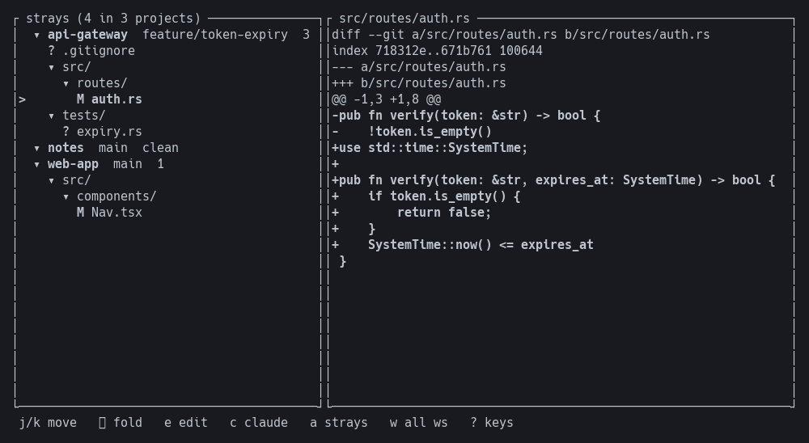
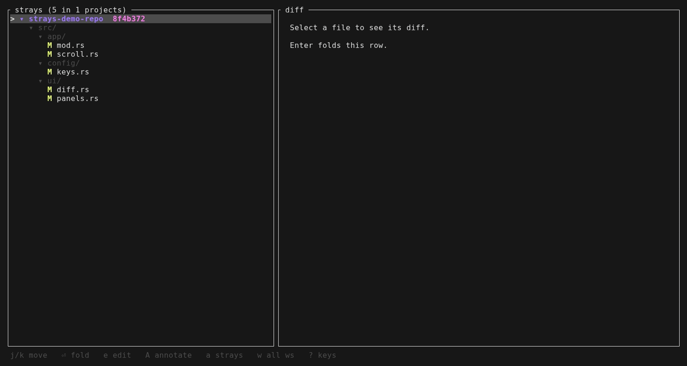
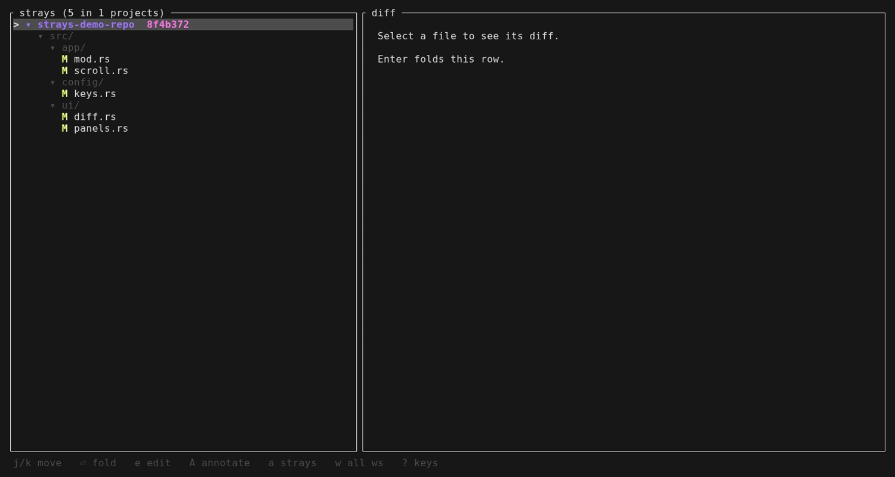

# strays

**See what changed. Read the diff. Hand it to Claude. Without leaving your terminal.**

A [herdr](https://herdr.dev) plugin that keeps a live picture of every file that
wandered off from `HEAD` — across every project you have open — beside the work
you are already doing.





---

## Why

You have four repositories open and an agent working in two of them. Somewhere
in there, files are changing. Finding out which ones means leaving what you are
doing, running `git status` in each repo in turn, and reading four separate
answers.

strays replaces that with a pane that is already correct. It updates itself as
the worktree changes, groups files by project and directory, and puts the diff
one keystroke away.

## What it does

**Follows the worktree, live.**
The list updates as files change — saves, checkouts, an agent editing on your
behalf. Driven by filesystem events, not a timer, so an idle repository costs
nothing and a busy one refreshes once rather than a hundred times.

**Knows about all your projects, shows you one.**
Opens scoped to the workspace you are in. One key widens it to every repository
herdr has open, each as its own foldable subtree.

**Puts the diff where you are looking.**
Select a file, read the change. Scroll a line, a screen, or straight to the end.
A position indicator tells you where you are in a long diff. When a line is
replaced, the words that actually changed are picked out within it, so a
one-identifier rename in a ninety-column line does not have to be found by eye.
The code is syntax highlighted in sixteen languages, so a diff reads the way it
does in your editor — colour tells you what a token is, red and green still tell
you whether it changed. `m` switches from "what have I changed since I
committed" to "what is on this branch", which is the question you ask before
opening a review — and the file list changes with it, so work you committed
earlier on the branch is there too.

**Hands work to Claude without a context switch.**
Write a prompt about the selected file and it lands in the agent running in that
repository, with the path already attached. The text is typed into the agent's
input, not submitted — you read it and press Enter yourself.

**Reviews the agent's work, line by line.**
Mark a line in the diff and say what is wrong with it — an issue, a suggestion,
a question. Collect notes across files, then hand the lot to the agent that
wrote the code. Notes are anchored by content as well as position, so they
follow their line when the code above shifts, and say so plainly when the line
they were written about is gone.

**Opens your editor, safely.**
`$VISUAL`, then `$EDITOR`. The file path is passed as its own argument behind a
`--` separator and never reaches a shell, so a filename from someone else's
branch stays a filename.

**Reads, never writes.**
Every git call is a query. No `add`, no `commit`, no `checkout`, no `stash`,
nothing written to `refs/`.

## In practice

| | |
|---|---|
| **Projects** | Discovered from the working directories of herdr's open panes. Several panes in one repository collapse into one entry. |
| **Scope** | The current workspace by default; `w` widens to all of them. |
| **Branch** | Shown beside each project name, so you can tell at a glance which repo is on which branch. A detached HEAD shows its short commit rather than the word `HEAD`. |
| **Diff scope** | Working tree vs `HEAD` — staged, unstaged and untracked in one tree. |
| **Markers** | `M` modified · `A` added · `D` deleted · `?` untracked · `R` renamed · `S` submodule. The glyph carries the meaning, so mono terminals and colour-blind readers lose nothing. |
| **Notes in the diff** | `TODO`, `FIXME`, `HACK` and `XXX` on the lines the open diff *adds* are counted on the status row, e.g. `TODO×2 FIXME×1`. Only added lines: a marker in surrounding context is somebody else's, and one on a removed line is debt being paid off. A count, not a verdict — nothing is drawn when there is nothing to report. |
| **Views** | Strayed files, or `a` for every tracked file with changed ones highlighted. |
| **`.gitignore`** | Honoured. Build output never reaches the tree. |
| **Large directories** | A directory holding 25 or more strays starts folded with its count shown, so a generated-output tree cannot bury real work. |
| **Submodules** | Shown as `S`, never offered to an editor — a gitlink is a directory. |

Press `a` and unchanged files join the list, dimmed, so a change stands out
against the repository around it:


## Keys

Press `?` in the pane for this list at any time.


| Key | |
|---|---|
| `j` `k` / `↓` `↑` | move |
| `⏎` `space` | fold or unfold |
| `J` `K` | scroll the diff by a line |
| `f` `b` | scroll the diff by a screen |
| `g` `G` | jump to the top or end of the diff |
| `e` | open in `$EDITOR` |
| `c` | write a prompt about this file for Claude |
| `/` | narrow the list to files matching what you type |
| `s` | search inside the diff |
| `n` `N` | next or previous match |
| `⇥` `⇧⇥` | move the mark down or up a diff line |
| `A` | note something about the marked line |
| `D` | drop the note on this line |
| `R` | hand every note to Claude |
| `a` | strays only ⇄ every tracked file |
| `w` | this workspace ⇄ all workspaces |
| `m` | diff against the branch point ⇄ against HEAD |
| `V` | one column ⇄ old beside new, as an editor shows it |
| `r` | refresh now |
| `?` | keys |
| `q` | quit |

`s` searches inside the open diff, and `n` walks the matches without leaving
the file:



`m` swaps the comparison. Against `HEAD` you see what you have not committed;
against the branch point you see everything the branch has done, which is the
diff a reviewer will read. The panel title says which one you are looking at:


`V` splits the diff into two columns: the file as it was on the left, as it is
on the right, the way an editor shows a comparison. A replaced line sits
opposite its replacement; a line that was only added or only removed leaves the
other column blank, so the shape of the change is visible without reading the
`+` and `-` marks. The pairing is positional — the first removal in a run is
shown against the first addition — which is right when a run edits its lines in
place and honest when it does not, since a line with no counterpart is given
none.


The capitals open a second view of the same file. Each is a toggle — press it
again and the diff comes back.

| Key | |
|---|---|
| `B` | who last touched each line |
| `H` | the commits that touched this file |
| `S` | what has been set aside in a stash |
| `W` | the branches here, to compare against |
| `L` | the shape of the recent history |

Inside any of them, `j` `k` move and `⏎` shows what the row names — a commit, a
stash, or the diff against a branch.


`Y` opens the git menu, and the next key says what to ask for. strays does not
write to the repository itself — it hands the work to the agent and shows you
what came back. Any other key abandons the sequence rather than guessing.

| Key | |
|---|---|
| `c` | commit |
| `s` | stage |
| `u` | unstage |
| `t` | stash |
| `l` | hand the terminal to lazygit |

`l` is the exception: staging individual lines is a conversation with a diff
rather than an instruction, so lazygit gets the terminal until you quit it.

## Config

Optional. Without a config file strays behaves exactly as above — every
default below is what the code used before any of it was settable.

The file lives at `$XDG_CONFIG_HOME/herdr-strays/config.toml`, or
`~/.config/herdr-strays/config.toml` when `XDG_CONFIG_HOME` is unset. A file
that cannot be read or parsed is reported in the status bar and the defaults
are used, so a misplaced comma never leaves you without a panel.

```toml
[thresholds]
auto_fold = 25              # a directory with at least this many strays starts folded
side_by_side_min_width = 80 # below this width the panes stack instead of splitting
tick_ms = 250               # how long the loop waits on a key before re-checking the watch
debounce_ms = 400           # how long a burst of file changes has to settle before a re-scan
max_commits = 200           # how many commits the history and graph panes read

[panels]
show_all = false     # start listing every tracked file, not only the strays
show_help = false    # start with the key reference open
side_by_side = true  # allow the diff beside the list; false stacks it at every width

[forge]
enabled = true       # ask the hosting forge about each repository
interval_secs = 120  # how long an answer stands before it is asked for again

[keys]
x = "open-editor"    # bind a key
d = "page-diff-down" # takes `d` from whatever held it
q = false            # unbind a key entirely
```

With `[forge]` on, a project row also carries what GitHub says about the branch
it is on. A row can end up reading `↑3 ✗ 3pr 4💬 ±` — five answers at once, none
of which spell themselves out:

| Mark | On a project row |
|---|---|
| `↑3↓5` | three commits to push, five to pull |
| `●` `○` | an agent is working here, or waiting |
| `✓` `✗` | the last CI run passed, or failed |
| `◔` `–` | it is still going, or was cancelled |
| `tests✗` | what failed was the tests, not a linter or a build step |
| `3pr` | three pull requests are open here |
| `4💬` | four comments on the pull request for the branch you are on |
| `±` | a reviewer asked for changes and has not since approved |

| Mark | In the diff |
|---|---|
| `▸` | where the cursor is |
| `💬` | a reviewer wrote about this line |
| `◆` | you left a note on this line |

Three of those are narrower than they look. `tests✗` is only drawn when the
failing step can be named as the tests: a broken build and broken tests lead to
different files and different work, but blaming the tests for a failure this
cannot classify would be a guess, so it says nothing instead. The comment count
and `±` are separate because they answer different questions — twenty comments
can all be agreement, and one "changes requested" with nothing written still
blocks the merge. And both are about the reader's own pull request, the one for
the branch checked out, not everybody else's.

Nothing is drawn where nothing is known: a repository the forge has not
answered for, and a pull request nobody has reviewed, both stay blank rather
than showing a placeholder that reads like an answer.

The count says somebody spoke; the diff says what they said. A line a reviewer
wrote about carries `💬` in the gutter, and stepping onto it puts their words
and their name on the status row. A reviewer's mark wins over your own `◆` when
both land on one line: you already know what you wrote there, and what you may
not know is that somebody answered it. Comments the forge no longer places on a
line — the code was rewritten underneath them — are dropped rather than drawn
somewhere close, since attaching somebody's objection to code they never saw is
worse than not showing it.

Those words then travel with the review. Sending notes to the agent quotes what
reviewers already said on the same lines, attributed, so the agent about to
change a line can read the objection that prompted it rather than guess at a
conversation it was never shown. Only lines you actually noted are quoted; the
rest of the pull request would be a transcript, not a review.

This runs `gh`, on its own thread and never on the path that draws the list, so
a slow network delays a mark and nothing else. Repositories not on GitHub, and
machines where `gh` is missing or unauthenticated, simply carry no mark. Set
`enabled = false` to make no network calls at all — worth doing on a metered
connection. `interval_secs = 0` is refused rather than clamped: it would ask on
every frame, and turning the forge off is how you say "never ask".

Keys are spelled as a single character for itself (`x`, and `K` is not `k`), or
as a name: `space`, `enter`, `tab`, `back-tab`, `up`, `down`, `left`, `right`,
`home`, `end`, `page-up`, `page-down`, `backspace`, `delete`, `insert`. Prefix
`ctrl-` for a control chord, as in `ctrl-c`.

Binding a key adds it to that action — `x = "open-editor"` leaves `e` working
too. What a binding takes away is the key's own former meaning, which is what
lets you move a key rather than only add one. The key reference under `?` reads
the bindings in force, so it names your keys and not the defaults.

Action names, for the right-hand side:

`quit`, `help`, `refresh`, `select-next`, `select-previous`,
`toggle-collapsed`, `scroll-diff-down`, `scroll-diff-up`, `page-diff-down`,
`page-diff-up`, `scroll-diff-home`, `scroll-diff-end`, `toggle-base`,
`toggle-split-diff`, `toggle-show-all`, `toggle-scope`, `toggle-blame`,
`toggle-history`,
`toggle-stashes`, `toggle-branches`, `toggle-graph`, `begin-filter`,
`begin-search`, `search-next`, `search-previous`, `cursor-down`, `cursor-up`,
`begin-annotation`, `remove-annotation`, `send-review`, `open-editor`,
`begin-prompt`, `git-menu`.

An unknown action name or an unknown key is an error naming the line, not a
silently dropped entry.

## For scripts and agents

`herdr-strays --json` writes the same picture to stdout and exits — every
project, its branch, how far ahead or behind it is, and which files strayed.
Three switches add what the panel shows beside that list:

```sh
herdr-strays --json               # projects, branches, strays
herdr-strays --json --annotations # the notes you wrote on diff lines
herdr-strays --json --agents      # what the agent in each repo is doing
herdr-strays --json --forge       # what GitHub says about each branch
```

Each is off unless asked for, and a key that was not asked for is absent rather
than `null` — so a consumer can tell "I did not ask" from "there was no answer".
Inside `--forge`, a repository the forge said nothing about is `null` for that
reason: the question was put and came back empty.

`--forge` is the one switch that reaches the network, for the same reason
`[forge]` is opt-in in the config: a script that did not ask for it should not
wait on `gh`. It asks the same way the panel does, so the two cannot disagree
about which repositories strays knows how to ask about — but without the thread,
since a single run has no frame to keep responsive and can afford to wait.

The switches need `--json`; on their own they are an error rather than a silent
no-op.

## Install

You need herdr 0.7.0+ and `git` on `PATH`. No Rust toolchain: the install
downloads the binary built for your platform and checks its SHA-256 before
putting it in place.

```sh
herdr plugin install aleslanger/herdr-strays
```

Bind it to a key in `~/.config/herdr/config.toml`:

```toml
[[keys.command]]
key = "prefix+d"
type = "plugin_action"
command = "aleslanger.strays.open"
description = "which files strayed from HEAD"
```

Then reload the running server:

```sh
herdr server reload-config
```

Pressing the key again focuses the pane rather than opening a second one; press
it while the pane is focused to dismiss it.

### From a checkout

Working on strays itself needs a Rust toolchain. `plugin link` skips the build
step, so `make link` builds and puts the binary where the manifest looks for it:

```sh
git clone https://github.com/aleslanger/herdr-strays
cd herdr-strays
make link
```

`make` on its own lists the rest.

### If there is no release for your platform

`scripts/install.sh` compiles from source when it cannot fetch and verify a
release — on an unusual platform, or with no network. That path needs `cargo`
on the `PATH` of the **herdr server**, which inherits it from whatever shell
started it, not from the one you are typing in. A server that was already
running when you installed Rust will not see it:

```sh
herdr server stop
herdr server
```

`rust-toolchain.toml` pins the version strays is built and linted with, so
rustup fetches that exact toolchain on the first `cargo` call. A `cargo` from a
distribution package ignores the pin and builds with whatever version it is;
that works as far back as the `rust-version` in `Cargo.toml`.

### On Windows

strays itself runs on Windows: it is built, tested, and released for it, and it
spawns no shell of its own. `herdr plugin install` is the one step that does not
work there — it runs `scripts/install.sh`, and there is no `sh` to run it with.
Rather than keep a second copy of the download-and-verify logic in PowerShell,
where the two would drift and the checksum check is the last thing worth getting
wrong twice, that one command is left as it is.

Either of the other two routes works:

- `herdr plugin link` from a checkout, which skips the build step entirely;
- or place the binary by hand — download `herdr-strays-x86_64-pc-windows-msvc.zip`
  from a release, check it against `SHA256SUMS`, and unpack `herdr-strays.exe`
  into `bin\` beside `herdr-plugin.toml`.

Config and annotations follow `XDG_CONFIG_HOME` and `XDG_STATE_HOME` as they do
everywhere else. With neither set they fall back to the home directory, which on
Windows means `%USERPROFILE%` — so the config file is
`%USERPROFILE%\.config\herdr-strays\config.toml`, not somewhere under `AppData`.
Set the XDG variables if you would rather it lived there.


## License

MIT — see [LICENSE](LICENSE).
